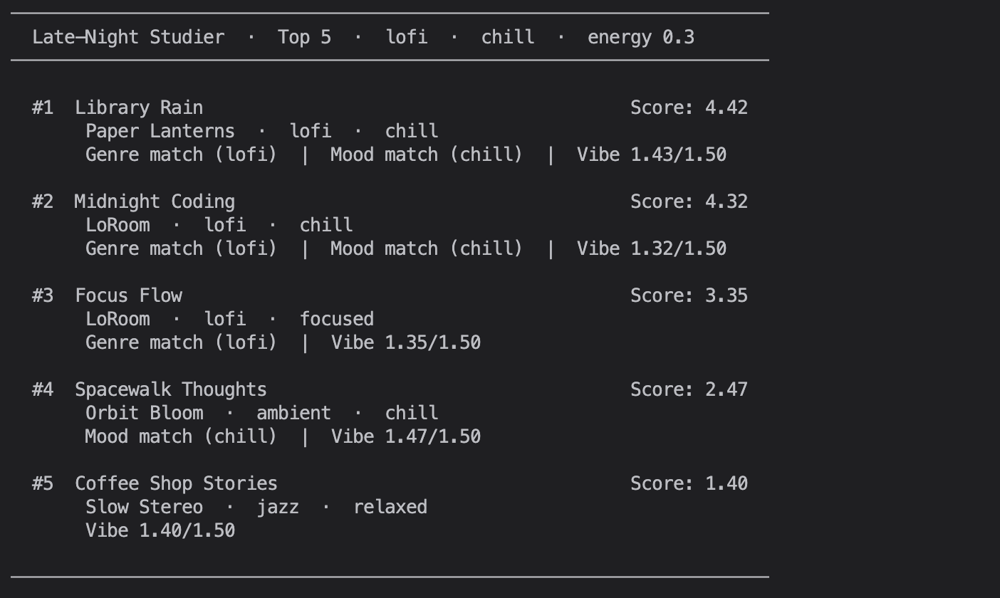
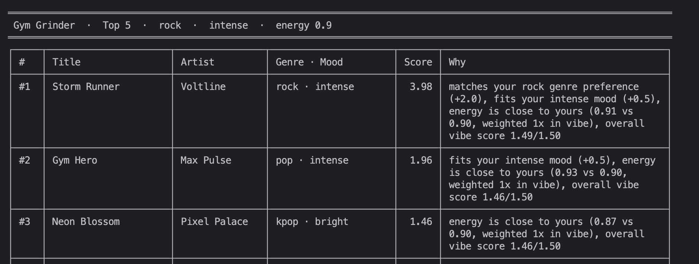
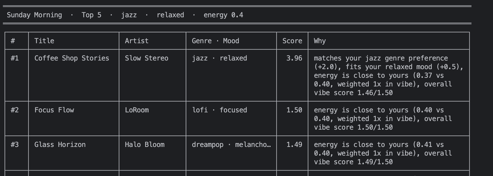
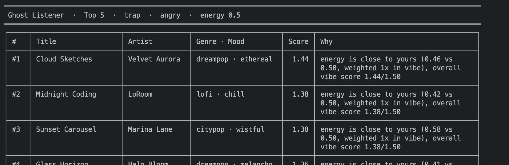
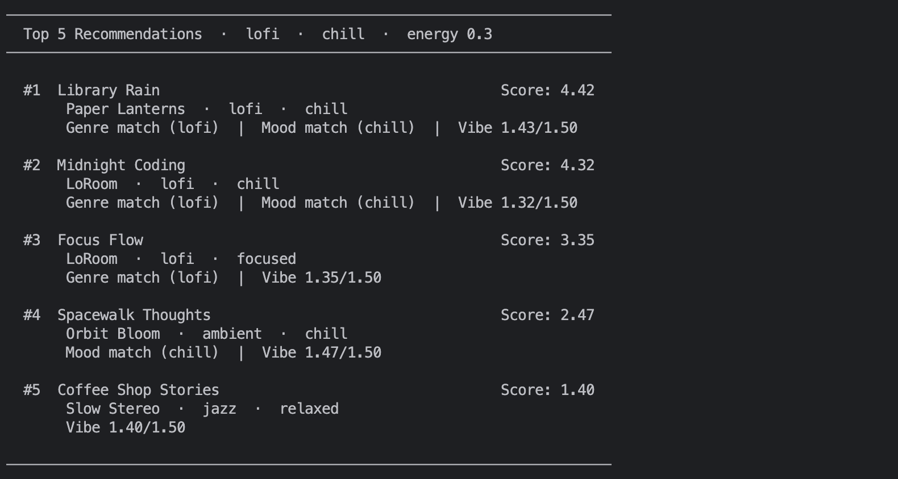

# 🎵 Music Recommender Simulation

## Project Summary

In this project you will build and explain a small music recommender system.

Your goal is to:

- Represent songs and a user "taste profile" as data
- Design a scoring rule that turns that data into recommendations
- Evaluate what your system gets right and wrong
- Reflect on how this mirrors real world AI recommenders

Replace this paragraph with your own summary of what your version does.

---

## How The System Works

How real-world recommenders use data features.

  Real-world recommenders work by extracting numerical features from both the song and the user, then using distance math to surface songs that are closest to the user's taste profile. Two approaches form the foundation. Content-based filtering analyzes a song's audio features — such as tempo, energy, and valence — to find songs with similar characteristics. Collaborative filtering takes the opposite approach: it looks at the behavior of users with similar listening patterns and recommends songs those users enjoyed. Spotify's core engine is largely built on collaborative filtering but combines both into a hybrid approach.

  Example:

  When Spotify ingests a new song, an audio analysis pipeline runs and produces a row like:

  `energy=0.82, tempo=128, valence=0.61, acousticness=0.04, danceability=0.75`

  That row is the song's feature vector. The user's profile is also a feature vector built from their listening history. The system computes the distance between the user's vector and every song's vector — songs with the smallest distance are the closest match and become the recommendations.

  Spotify's Smart Shuffle extends this by taking the songs already in your playlist and injecting new recommendations alongside them. The injected songs are selected by:

  - Matching the audio feature range of nearby songs already in the queue
  - Drawing from the user's taste neighborhood via collaborative filtering
  - Avoiding disruption to the current mood and tempo gradient


  **This System:**

  This simulation mirrors content-based filtering. Each song is scored against the user's taste profile using a point-weight system — genre, mood, and audio feature closeness each contribute to the score. Feedback from each play updates the session state, which filters what is eligible in the next round of recommendations.

  **Algorithm Recipe:**  
  Filter — Before scoring anything, rule out songs the user has already rejected (disqualified) or recently skipped (still in cooldown).

  Score — Every eligible song gets a score built from three signals: does the genre match (+2.0), does the mood match (+1.0), and how close is the song's sonic feel to the user's preference in energy, tempo, valence, and acousticness (+0 to +1.5). A previous skip shaves off -0.5.

  Rank — Sort all scored songs highest to lowest and return the top K.

  Play — The user listens. If they play it through, nothing changes.

  Feedback — If they skip, the song is penalized and put on a 25-song cooldown before it can return. A second skip or an "off" signal disqualifies it entirely. That feedback updates the session state and the cycle repeats from step 1.

  **Potential Biases:**

  - Since the profile only has limited options for the preferences, there could be more skew distance calculations against songs. Adding valence or acousticness could reduce it and improve recommendations.
  - Static profile during the session until the user shifts the context. If the user is listening to a genre but wants to slowly shift, it will not happen. 


  **Data Flow Draft**
  
  Inputs(User Profile, songs, session_state) ->  
  Eligibility Filter(ea. song in catalog: disqualify = drop music, queue less than cooldown = drop in cooldown, pass both = eligible ) ->  
  Process(Scoring Loop for the user's preference of each song in the csv file) ->  
  Ranking(sort song and score by descending -> slice Top K) ->  
  Output( list of songs = Top K results ) ->  
  Feedback Signals(play through = no change, skipped = first strike, 2nd strike will disqualify the song)

  **Mermaid Data Flow**
  ```mermaid
flowchart TD
    UP["User Profile\n(genre, mood, energy, tempo)"]
    SC["Song Catalog\n(songs.csv)"]
    SS["Session State\n(skip_count, disqualified, cooldown_until, queue_position)"]

    EF{"Eligibility Filter"}
    DROP["Drop Song"]

    SL["Scoring Loop\nscore_song(user, song)"]
    G["+2.0 Genre Match"]
    M["+1.0 Mood Match"]
    V["+0.0 → +1.5 Vibe Closeness\n(energy, tempo, valence, acousticness)"]
    SK["-0.5 if skip_count == 1"]

    RK["Ranking\nSort by score → Top K"]
    OUT["Output\n(song, score, explanation) × K"]

    FB{"Feedback Signal"}
    PLAYED["No Change"]
    SKIP1["1st Strike\nskip_count += 1\ncooldown_until = queue_pos + 25"]
    SKIP2["2nd Strike\ndisqualified = True"]
    OFF["Disqualified = True\n(immediate)"]

    UP --> EF
    SC --> EF
    SS --> EF

    EF -- "disqualified or in cooldown" --> DROP
    EF -- "eligible" --> SL

    SL --> G & M & V & SK --> RK
    RK --> OUT
    OUT --> FB

    FB -- "played through" --> PLAYED
    FB -- "skipped (1st)" --> SKIP1
    FB -- "skipped (2nd)" --> SKIP2
    FB -- "off" --> OFF

    SKIP1 --> SS
    SKIP2 --> SS
    OFF --> SS
    SS --> EF
```

---

# Profile Comparison Reflections


## Pair 1: Late-Night Studier vs Gym Grinder

**Profiles:** lofi / chill / energy 0.3 vs rock / intense / energy 0.9

These two profiles sit at opposite ends of the energy scale, and the output reflects that clearly.
Late-Night Studier surfaces quiet, low-tempo songs (Library Rain, Midnight Coding) while Gym Grinder
pulls high-energy tracks (Storm Runner, Gym Hero, Iron Pulse). The energy preference is doing real
work here — the genre and mood labels line up with the energy range, so the scoring is coherent.

Late-Night Studier holds genre-match quality for three spots
(lofi has 3 songs in the catalog), while Gym Grinder drops sharply after #2 because there is only one rock song. The remaining ranks started to shift to kpop/chill music. 
— which share the energy level but not the genre or mood. 




---

## Pair 2: Sunday Morning vs Ghost Listener

**Profiles:** jazz / relaxed / energy 0.4 vs trap / angry / energy 0.5

Sunday Morning targets moderate energy; has a strong match in the beginning but then falls off shifting to lofi. Ghost Listener has the same target but it is not the real aim to do so; it produced identical ranges of energy.

Both resulted the same filter bubble in their lists. Since the catalog does not have similar music to diverse, it will fallback to that bubble. 




---

## Pair 3: Gym Grinder vs Mismatch Maximizer

**Profiles:** rock / intense / energy 0.9 vs kpop / chill / energy 0.972 

High energy from both profiles, yey Mismatch contradicts itself in a way.The combination of the catalog songs have an energy around 0.42 to 0.8, it will not reach high 0.9s. Gym did get consisted top results, while Mismatch was close. 

Surprising part is rank 2 and 3, Midnight Coding and Library Rain, they are lofi/chill songs with an energy 0.42, Iron Pulse was the only perfect match for Gym. The mood label "chill" earns those lofi songs a +1.0 bonus that more than compensates for their poor energy
match.

---


## Getting Started

### Setup

1. Create a virtual environment (optional but recommended):

   ```bash
   python -m venv .venv
   source .venv/bin/activate      # Mac or Linux
   .venv\Scripts\activate         # Windows

2. Install dependencies

```bash
pip install -r requirements.txt
```

3. Run the app:

```bash
python -m src.main
```



### Running Tests

Run the starter tests with:

```bash
pytest
```

You can add more tests in `tests/test_recommender.py`.

---

## Experiments You Tried

Use this section to document the experiments you ran. For example:

- What happened when you changed the weight on genre from 2.0 to 0.5
- What happened when you added tempo or valence to the score
- How did your system behave for different types of users

---

## Limitations and Risks

Summarize some limitations of your recommender.

Examples:

- It only works on a tiny catalog
- It does not understand lyrics or language
- It might over favor one genre or mood

You will go deeper on this in your model card.

---

## Reflection

Read and complete `model_card.md`:

- [x] [**Model Card**](model_card.md)


